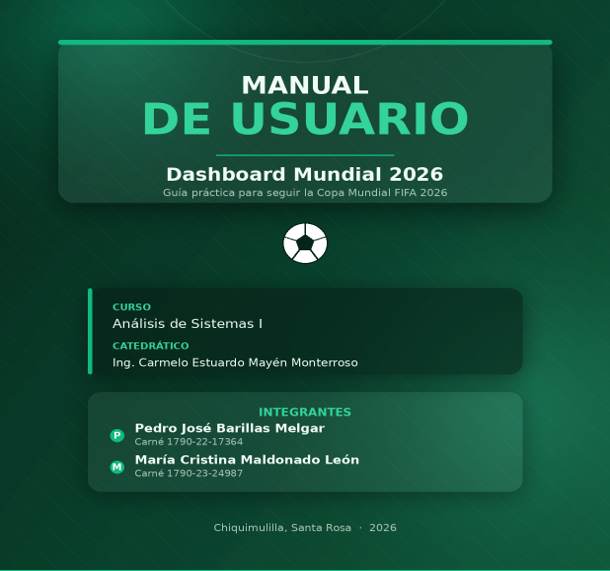
# MANUAL DE USUARIO
## Dashboard Mundial 2026

**Universidad Mariano Gálvez de Guatemala**
Centro Universitario de Chiquimulilla, Santa Rosa · 2026
Curso: Análisis de Sistemas I

---

## CONTENIDO

1. [Bienvenida](#1-bienvenida)
 - 1.1. ¿Qué puedes hacer con la aplicación?
2. [Primeros pasos](#2-primeros-pasos)
 - 2.1. Requisitos
 - 2.2. Cómo abrir la aplicación
3. [La pantalla principal](#3-la-pantalla-principal)
 - 3.1. El encabezado
 - 3.2. El panel de filtros
 - 3.3. La cuadrícula de partidos
4. [Buscar y filtrar partidos](#4-buscar-y-filtrar-partidos)
 - 4.1. La barra de búsqueda
 - 4.2. Los filtros desplegables
 - 4.3. Combinar filtros
 - 4.4. Limpiar los filtros
5. [Ver la información de un partido](#5-ver-la-información-de-un-partido)
 - 5.1. Pestaña Resumen
 - 5.2. Pestaña Convocados
 - 5.3. Pestaña Selecciones
 - 5.4. Pestaña Estadio
6. [Consejos y preguntas frecuentes](#6-consejos-y-preguntas-frecuentes)
 - 6.1. Consejos para aprovechar la aplicación
 - 6.2. Preguntas frecuentes
 - 6.3. Solución de problemas comunes
7. [¡A disfrutar el Mundial!](#7-a-disfrutar-el-mundial)

---

## 1. Bienvenida

Bienvenido a **Dashboard Mundial 2026**, una aplicación web pensada para que sigas toda la fase de grupos de la Copa Mundial FIFA 2026 de forma sencilla y visual. Desde una sola pantalla puedes consultar los partidos, conocer las selecciones, ver el clima de cada ciudad sede, revisar los convocados de cada equipo y descubrir datos curiosos de los estadios.

Este manual te guiará paso a paso para que aproveches todas las funciones de la aplicación, aunque sea la primera vez que la usas. No necesitas conocimientos técnicos: solo un navegador y ganas de disfrutar el Mundial.

### 1.1. ¿Qué puedes hacer con la aplicación?
| Función | Descripción |
|---|---|
| **Ver los partidos** | Consulta el listado completo de los partidos de la fase de grupos con su sede y horario. |
| 🇬🇹 **Hora de Guatemala** | Cada partido muestra su hora ya convertida a la hora de Guatemala, sin cálculos manuales. |
| **Buscar y filtrar** | Encuentra partidos por equipo, grupo, fecha, sede, estado y más, combinando filtros. |
| **Clima de la sede** | Revisa el clima actual y el pronóstico de la ciudad donde se juega cada partido. |
| **Selecciones** | Conoce el entrenador, el ranking FIFA, los títulos y la historia de cada equipo. |
| **Convocados** | Explora la lista de jugadores de cada selección y lee la biografía de cada uno. |

---

## 2. Primeros pasos

### 2.1. Requisitos

Para usar la aplicación solo necesitas:

- Una computadora, tablet o teléfono con **conexión a internet**.
- Un **navegador web actualizado**, como Google Chrome, Microsoft Edge o Mozilla Firefox.

> **Recomendación:** Para una mejor experiencia, te sugerimos usar la aplicación en una computadora o laptop. La pantalla más grande permite ver mejor las tarjetas de los partidos y toda la información detallada.

### 2.2. Cómo abrir la aplicación

1. Abre tu navegador web preferido.
2. Ingresa la dirección de la aplicación en la barra de direcciones.
3. Espera unos segundos mientras la página carga. Verás aparecer la pantalla principal con el encabezado del Mundial 2026.

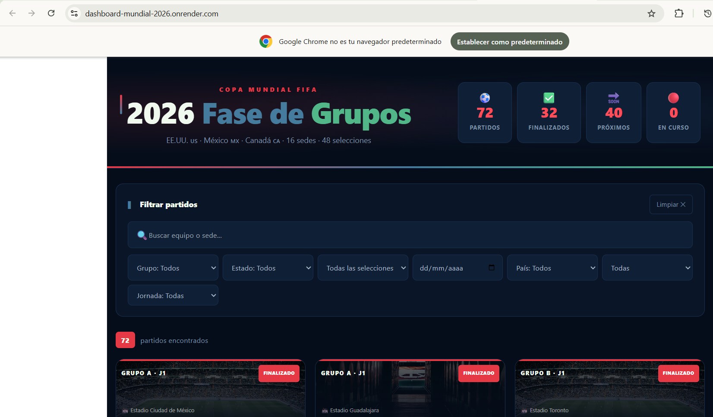

> **¿La página tarda en cargar?** La primera vez que abras la aplicación, algunos datos como las banderas y el clima se descargan de internet. Si tu conexión es lenta, espera unos segundos a que todo aparezca completo.

---

## 3. La pantalla principal

Al abrir la aplicación, lo primero que verás es la **pantalla principal**, dividida en tres zonas claramente diferenciadas que te ayudarán a orientarte.

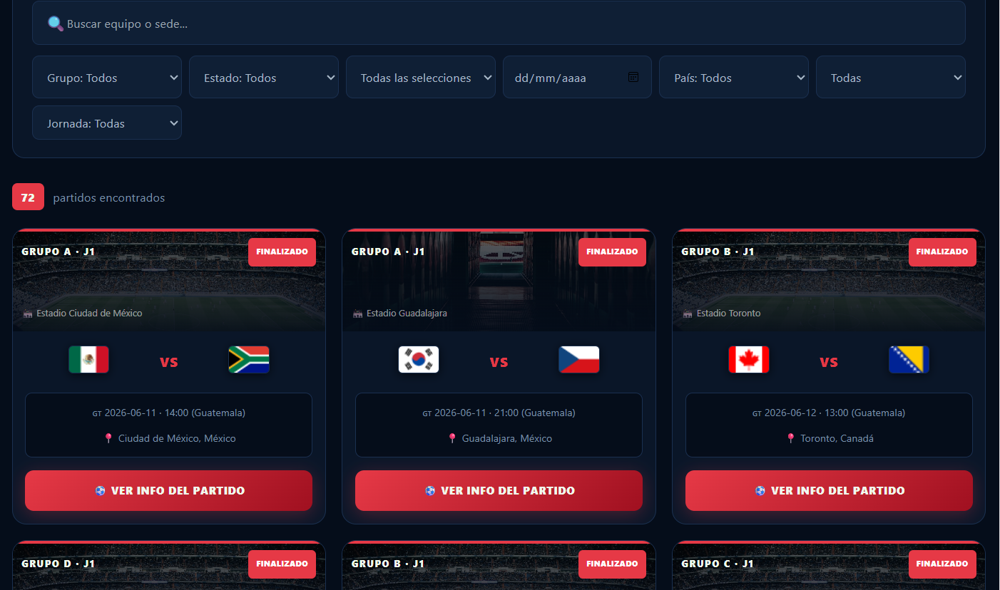

### 3.1. El encabezado

En la parte superior se muestra el título del torneo, los países anfitriones (Estados Unidos, México y Canadá) y un resumen rápido con cuatro contadores animados:
| Contador | Qué significa |
|---|---|
| **Partidos** | Número total de partidos disponibles en la aplicación. |
| **Finalizados** | Partidos que ya se jugaron. |
| **Próximos** | Partidos que aún no han comenzado. |
| **En curso** | Partidos que se están jugando en este momento. |

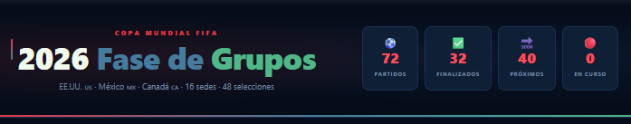

### 3.2. El panel de filtros

Justo debajo del encabezado encontrarás el **panel de filtros**, que te permite encontrar rápidamente los partidos que te interesan. Lo explicamos en detalle en el siguiente capítulo.

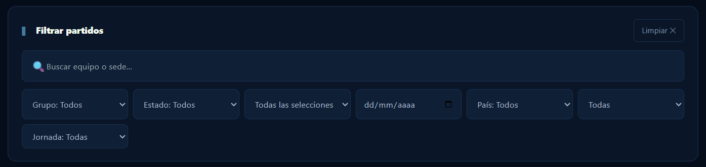

### 3.3. La cuadrícula de partidos

Ocupa la mayor parte de la pantalla. Cada partido se muestra como una **tarjeta** con la imagen del estadio, las banderas de las dos selecciones, la fecha y hora en Guatemala, la ciudad y un botón para ver toda la información. En la esquina de cada tarjeta verás una etiqueta de color que indica el estado del partido:
| Color de la etiqueta | Estado del partido |
|---|---|
| Azul | Próximo — todavía no se juega. |
| Verde | En curso — se está jugando ahora. |
| Rojo | Finalizado — el partido ya terminó. |

---

## 4. Buscar y filtrar partidos

El panel de filtros es una de las herramientas más útiles de la aplicación. Puedes combinar varios filtros a la vez para encontrar exactamente lo que buscas.

### 4.1. La barra de búsqueda

Es el campo de texto con el ícono de lupa . Escribe el nombre de una selección o de una sede y la lista de partidos se actualizará al instante mostrando solo las coincidencias. Por ejemplo, si escribes **"México"**, verás únicamente los partidos en los que participa esa selección.

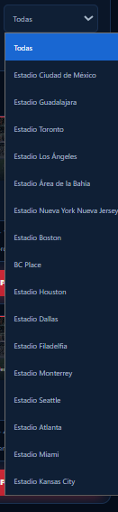

### 4.2. Los filtros desplegables

Debajo de la barra de búsqueda hay varios menús desplegables. Al hacer clic en cualquiera se abre una lista de opciones para elegir:
| Filtro | Para qué sirve |
|---|---|
| **Grupo** | Muestra solo los partidos de un grupo específico (del A al L). |
| **Estado** | Filtra por Próximo, En curso o Finalizado. |
| **Selección** | Muestra los partidos de la selección que elijas. |
| **Fecha** | Selecciona un día concreto en el calendario. |
| **País** | Filtra por país anfitrión: Estados Unidos, México o Canadá. |
| **Sede** | Muestra los partidos de un estadio en particular. |
| **Jornada** | Filtra por Jornada 1, 2 o 3 de la fase de grupos. |

### 4.3. Combinar filtros

Puedes usar varios filtros al mismo tiempo. Por ejemplo, para ver los partidos del **Grupo A** que se juegan en **México**, selecciona "Grupo A" en el filtro de grupo y "México" en el filtro de país. La aplicación mostrará solo los partidos que cumplan ambas condiciones.

> ℹ **Contador de resultados:** Sobre la cuadrícula de partidos verás un número que indica cuántos partidos coinciden con los filtros aplicados. Así sabrás de un vistazo cuántos resultados encontraste.

### 4.4. Limpiar los filtros

Si quieres volver a ver todos los partidos, haz clic en el botón **"Limpiar "** que está en la esquina del panel de filtros. Esto restablece todos los filtros y la búsqueda a su estado original.

---

## 5. Ver la información de un partido

Para conocer todos los detalles de un partido, busca su tarjeta y haz clic en el botón **" Ver info del partido"**. Se abrirá una ventana emergente con la información organizada en cuatro pestañas.

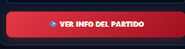

> ℹ **Cómo cerrar la ventana:** Para cerrar la ventana de detalle y volver a la lista de partidos, haz clic en la **X** de la esquina superior derecha o haz clic fuera de la ventana, en cualquier zona oscurecida.

### 5.1. Pestaña Resumen

Es la primera pestaña que se muestra. Combina dos bloques de información muy útiles:

- **Clima de la sede:** la temperatura actual, la sensación térmica, la humedad, el viento y un pronóstico para los próximos tres días.
- **Fichas de país y comparación:** los datos principales de cada selección (capital, región, idiomas, moneda, población y zona horaria) y una tabla que las compara lado a lado.

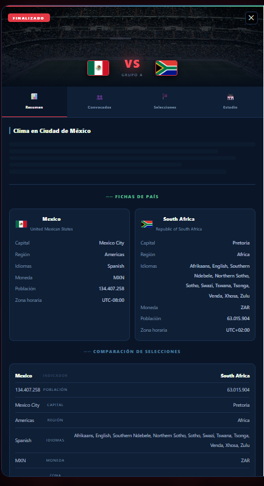

### 5.2. Pestaña Convocados

Muestra la lista de jugadores convocados de cada selección. Puedes cambiar entre un equipo y otro con los botones de la parte superior. Los jugadores están ordenados por posición: porteros, defensas, mediocampistas y delanteros.

> **Ver el perfil de un jugador:** Haz clic sobre cualquier jugador para abrir su perfil, donde verás su foto y una breve biografía obtenida de Wikipedia. Para cerrar el perfil, haz clic en la **X** o fuera de la ventana.

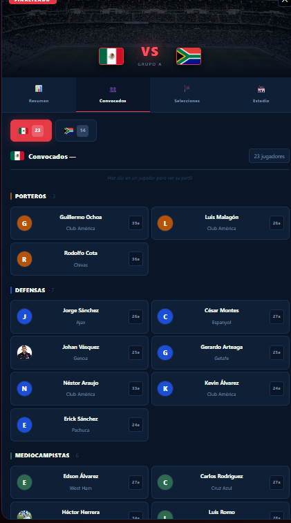

### 5.3. Pestaña Selecciones

Aquí encontrarás información general de cada selección: la confederación a la que pertenece, su entrenador actual, su posición en el ranking FIFA, la cantidad de títulos mundiales que ha ganado y una descripción con su historia y sus jugadores destacados. Usa los botones superiores para alternar entre los dos equipos.

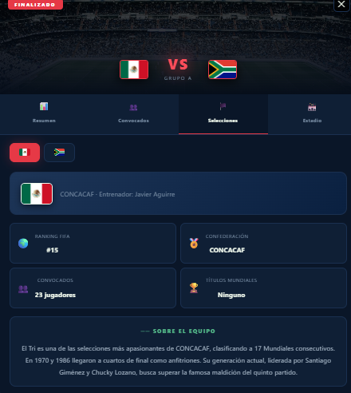

### 5.4. Pestaña Estadio

Muestra los detalles del estadio donde se juega el partido: una fotografía, su capacidad de espectadores, el año en que fue inaugurado, el tipo de superficie de juego y el país anfitrión. También incluye la fecha y la hora del partido (la hora local de la sede y la hora de Guatemala) y una descripción con datos históricos y curiosidades del recinto.

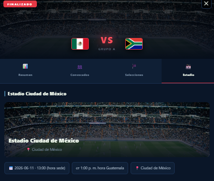

---

## 6. Consejos y preguntas frecuentes

### 6.1. Consejos para aprovechar la aplicación
| Consejo | Descripción |
|---|---|
| **Encuentra a tu selección** | Usa la barra de búsqueda para llegar rápido a tu equipo favorito sin recorrer toda la lista. |
| **Planifica tu semana** | Combina el filtro de Estado con el de Fecha para saber qué partidos ver cada día. |
| **Datos curiosos** | Explora la pestaña Estadio para conocer la historia del recinto antes de cada partido. |
| **Revisa el clima** | Consulta el clima antes de un partido para saber en qué condiciones se jugará. |

### 6.2. Preguntas frecuentes
| Pregunta | Respuesta |
|---|---|
| ¿Las horas están en hora de Guatemala? | Sí. Todas las horas de los partidos se muestran ya convertidas a la hora de Guatemala. |
| ¿Por qué no aparece la foto de un jugador? | Las fotos provienen de Wikipedia. Si un jugador no tiene foto, se muestra la inicial de su nombre. |
| ¿Por qué no carga el clima? | El clima se obtiene de internet en tiempo real. Verifica tu conexión e intenta abrir el partido de nuevo. |
| ¿Puedo usarla en el teléfono? | Sí, funciona en teléfonos y tablets, aunque se ve mejor en una pantalla grande. |
| ¿Necesito crear una cuenta? | No. La aplicación es de consulta libre y no requiere registro ni inicio de sesión. |

### 6.3. Solución de problemas comunes
| Problema | Qué hacer |
|---|---|
| No aparece ningún partido | Los filtros pueden ser muy específicos. Haz clic en "Limpiar " para restablecerlos. |
| Las banderas no se ven | Recarga la página con la tecla **F5**. Pueden tardar con conexiones lentas. |
| La ventana de detalle no abre | Recarga la página e inténtalo de nuevo haciendo clic en el botón del partido. |
| Las imágenes de estadios no cargan | La aplicación mostrará una imagen alternativa automáticamente; no afecta el resto. |

---

## 7. ¡A disfrutar el Mundial!

Con esta guía ya conoces todas las funciones de **Dashboard Mundial 2026**. Esperamos que la aplicación te acompañe durante toda la fase de grupos y te ayude a vivir de cerca cada partido, cada selección y cada sede de la Copa Mundial FIFA 2026.

---

> **Proyecto académico:** Manual de usuario elaborado para el curso de Análisis de Sistemas I, Universidad Mariano Gálvez de Guatemala — Centro Universitario de Chiquimulilla, Santa Rosa. 2026.

**Copa Mundial FIFA 2026**
Estados Unidos · México · Canadá
