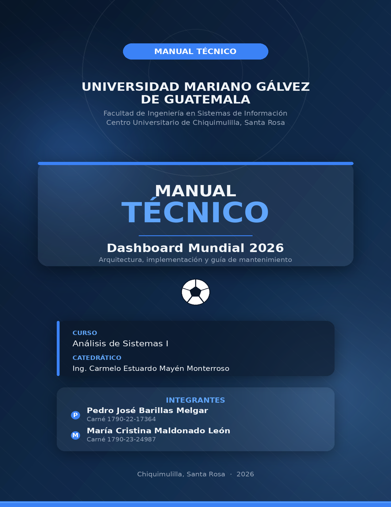
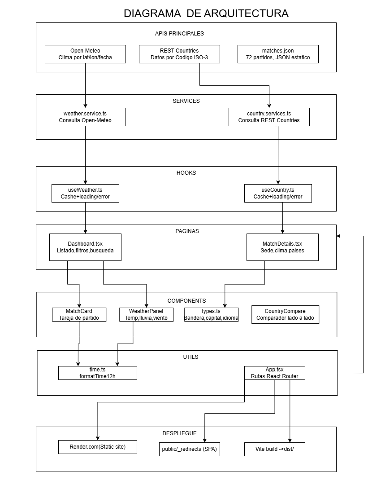

# MANUAL TÉCNICO DEL SISTEMA
## DASHBOARD MUNDIAL 2026


**Proyecto:** Dashboard Mundial 2026  
**Curso:** Análisis de Sistemas I  
**Institución:** Universidad Mariano Gálvez de Guatemala  
**Centro Universitario:** Chiquimulilla, Santa Rosa  
**Año:** 2026


## TABLA DE CONTENIDO

| Sección | Título | Página |
|---------|--------|--------|
| 1. | Introducción | 3 |
| 1.1. | Objetivos del sistema | 4 |
| 1.2. | Alcance | 5 |
| 2. | Tecnologías y herramientas | 6 |
| 2.1. | APIs externas consumidas | 7 |
| 3. | Arquitectura del proyecto | 8 |
| 3.1. | Estructura de carpetas | 9 |
| 3.2. | Capas de la aplicación | 10 |
| 3.3. | Flujo de datos | 11 |
| 4. | Módulos y componentes | 12 |
| 4.1. | Componente principal: Dashboard | 13 |
| 4.2. | Subcomponentes internos del Dashboard | 14 |
| 4.3. | Componentes independientes | 15 |
| 4.4. | Hooks personalizados | 16 |
| 5. | Lógica clave del sistema | 17 |
| 5.1. | Conversión de zonas horarias | 18 |
| 5.2. | Sistema de filtros | 19 |
| 5.3. | Banderas e imágenes | 20 |
| 6. | Instalación y ejecución | 21 |
| 6.1. | Requisitos previos | 22 |
| 6.2. | Pasos de instalación | 23 |
| 6.3. | Scripts disponibles | 24 |
| 7. | Mantenimiento | 25 |
| 7.1. | Variables de color del tema | 26 |
| 8. | Conclusión | 27 |


## 1. INTRODUCCIÓN

El presente manual técnico documenta de manera exhaustiva la arquitectura, el diseño y los detalles de implementación de la aplicación web **Dashboard Mundial 2026**, desarrollada como proyecto académico para el curso de Análisis de Sistemas I en la Universidad Mariano Gálvez de Guatemala, Centro Universitario de Chiquimulilla, Santa Rosa.

### 1.1. Contexto del proyecto

La Copa Mundial de la FIFA 2026 representa un evento de trascendencia global que se celebrará por primera vez en tres países anfitriones: Estados Unidos, México y Canadá. Este torneo contará con una fase de grupos ampliada a 48 selecciones nacionales distribuidas en 12 grupos de 4 equipos cada uno, lo que totaliza 104 partidos en esta fase preliminar. La magnitud del evento y la diversidad geográfica de las sedes presentan desafíos significativos para los aficionados y seguidores del fútbol que desean mantenerse informados sobre el desarrollo del torneo.

### 1.2. Problemática abordada

Ante la dispersión de información oficial en múltiples plataformas, la dificultad para calcular horarios en diferentes zonas horarias y la falta de integración de datos contextuales (clima, estadios, convocatorias), surge la necesidad de una solución centralizada que ofrezca:

- **Consolidación de datos**: Unificar en un solo punto de acceso toda la información relevante de la fase de grupos.
- **Conversión horaria automática**: Mostrar los horarios de los partidos adaptados a la hora local de Guatemala, eliminando confusiones por diferencias de zona horaria.
- **Enriquecimiento contextual**: Proveer datos adicionales como clima de las sedes, información de los estadios, perfiles de jugadores y datos demográficos de los países participantes.

### 1.3. Naturaleza del sistema

El sistema es una **aplicación de página única (SPA - Single Page Application)** construida con tecnologías modernas del ecosistema JavaScript. Su naturaleza frontend le permite operar con alta eficiencia, ofreciendo una experiencia de usuario fluida y responsiva, accesible desde cualquier dispositivo con conexión a internet.

La arquitectura adoptada sigue los principios de **separación de responsabilidades**, dividiendo claramente la lógica de presentación, la lógica de negocio y el acceso a datos. Esto facilita el mantenimiento, las pruebas y futuras ampliaciones del sistema.

### 1.4. Público objetivo del manual

Este documento está dirigido a:

- **Desarrolladores** que necesiten comprender la estructura interna del proyecto para realizar modificaciones o ampliaciones.
- **Personal de mantenimiento** encargado de la operación continua del sistema.
- **Estudiantes** de cursos posteriores que utilicen este proyecto como referencia o base para sus propios desarrollos.
- **Docentes y evaluadores** que requieran verificar la calidad técnica y la documentación del proyecto.

### 1.5. Prerrequisitos de conocimiento

Se asume que el lector posee conocimientos básicos de:

- **JavaScript/TypeScript**: Comprensión de la sintaxis, tipos de datos, funciones y programación asíncrona.
- **React**: Familiaridad con componentes, estado, props, hooks y el ciclo de vida de los componentes.
- **Línea de comandos**: Manejo básico de terminal para ejecutar comandos de instalación y construcción.
- **Control de versiones**: Conceptos fundamentales de Git para clonar y gestionar el repositorio.


## 1.1. OBJETIVOS DEL SISTEMA

### 1.1.1. Objetivo general

Desarrollar una aplicación web interactiva que centralice y presente de manera organizada toda la información relevante de la fase de grupos de la Copa Mundial FIFA 2026, facilitando el acceso y la comprensión de los datos para los usuarios interesados en el evento deportivo.

### 1.1.2. Objetivos específicos

1. **Centralización de información**
   - Consolidar en una sola interfaz los 104 partidos de la fase de grupos, incluyendo sedes, horarios y selecciones participantes.
   - Proporcionar información detallada de cada selección, estadio y ciudad anfitriona.
   - Integrar datos de convocatorias de jugadores por equipo.

2. **Gestión horaria automatizada**
   - Implementar un sistema de conversión de zonas horarias que muestre automáticamente los partidos en la hora de Guatemala.
   - Evitar errores de interpretación de horarios derivados de las diferencias horarias entre sedes.
   - Calcular y mostrar el estado actual de cada partido (próximo, en curso o finalizado).

3. **Enriquecimiento de datos mediante APIs externas**
   - Consumir servicios web para obtener información de países (capital, región, idiomas, moneda, población).
   - Integrar datos climáticos en tiempo real de las ciudades anfitrionas.
   - Obtener biografías e imágenes de jugadores desde fuentes confiables.

4. **Sistema de búsqueda y filtrado avanzado**
   - Ofrecer un panel de filtros con múltiples criterios (grupo, estado, selección, fecha, país, sede, jornada).
   - Permitir búsqueda por texto libre sobre nombres de equipos y sedes.
   - Aplicar filtros de forma acumulativa y en tiempo real.

5. **Experiencia de usuario óptima**
   - Diseñar una interfaz visualmente atractiva con temática deportiva.
   - Asegurar la responsividad para dispositivos móviles y de escritorio.
   - Proporcionar retroalimentación visual clara sobre estados de carga, error y resultados vacíos.


## 1.2. ALCANCE

### 1.2.1. Cobertura funcional

El sistema cubre exclusivamente la **fase de grupos** del torneo, que comprende:

- **12 grupos** (A, B, C, D, E, F, G, H, I, J, K, L)
- **48 selecciones nacionales** participantes
- **104 partidos** en total
- **16 sedes** distribuidas en los tres países anfitriones

### 1.2.2. Inclusión de datos

**Datos estáticos** incluidos en el código fuente:
- Información de selecciones (nombre, código FIFA, confederación, entrenador, ranking, descripción)
- Datos de estadios (nombre, ciudad, capacidad, año de inauguración, superficie, descripción)
- Convocatorias de jugadores por equipo (nombre, posición, número de camiseta, club)
- Calendario completo de partidos con fechas, horarios y sedes

**Datos dinámicos** obtenidos en tiempo de ejecución:
- Información detallada de países (capital, región, idiomas, moneda, población, zona horaria)
- Clima actual y pronóstico de 3 días para cada ciudad sede
- Biografías e imágenes de jugadores desde Wikipedia

### 1.2.3. Exclusiones del sistema

El sistema **NO** contempla:
- **Gestión de usuarios**: No hay registro, autenticación ni perfiles de usuario.
- **Persistencia en base de datos**: Toda la información se consume en tiempo real o se incluye estáticamente.
- **Sistema de notificaciones**: No se envían alertas ni recordatorios de partidos.
- **Fase eliminatoria**: El sistema se limita a la fase de grupos, sin cubrir octavos de final, cuartos, semifinales o final.
- **Edición de datos**: No se permite la modificación de la información de partidos, selecciones o estadios.
- **Comentarios o interacción social**: No hay funcionalidades de foro, comentarios o calificaciones.
- **Transmisión en vivo**: No se integran servicios de streaming o retransmisión de partidos.

### 1.2.4. Limitaciones técnicas

- **Disponibilidad de APIs externas**: El sistema depende de la disponibilidad de los servicios web consumidos. Si una API no responde, la funcionalidad asociada se ve afectada.
- **Fotos de jugadores**: Dependen de la disponibilidad de imágenes en Wikipedia y pueden no estar disponibles para todos los jugadores.
- **Zonas horarias**: Aunque se implementa una conversión precisa, se recomienda verificar los horarios con fuentes oficiales para confirmación.
- **Rendimiento**: En dispositivos con recursos limitados, el manejo de grandes volúmenes de datos puede presentar ralentizaciones.


## 2. TECNOLOGÍAS Y HERRAMIENTAS

La aplicación se construyó sobre un **stack moderno de desarrollo frontend**, seleccionando cada tecnología por sus capacidades específicas y su compatibilidad con los requerimientos del proyecto. A continuación se detalla el ecosistema tecnológico empleado.

### 2.1. Resumen de tecnologías

| Tecnología | Versión | Propósito |
|------------|---------|-----------|
| **React** | 19.2 | Librería principal para construir la interfaz mediante componentes |
| **TypeScript** | 6.0 | Superset de JavaScript que añade tipado estático y seguridad |
| **Vite** | 8.0 | Herramienta de construcción y servidor de desarrollo con HMR |
| **React Router DOM** | 7.17 | Manejo de rutas dentro de la SPA |
| **TanStack React Query** | 5.10 | Peticiones asíncronas, caché y estados de carga/error |
| **Axios** | 1.18 | Cliente HTTP para peticiones a APIs externas |
| **Tailwind CSS** | 3.4 | Framework de utilidades CSS en componentes puntuales |
| **ESLint** | 10.3 | Análisis estático de código para mantener la calidad |

### 2.2. Descripción detallada de tecnologías

#### 2.2.1. React 19.2

React es la librería fundamental del proyecto. Su modelo de componentes permite:

- **Reutilización de código**: Componentes como `WeatherPanel`, `FichaCard` o `SquadTab` pueden ser utilizados en múltiples contextos.
- **Estado y ciclo de vida**: Manejo eficiente del estado de la aplicación mediante hooks como `useState`, `useEffect` y `useMemo`.
- **Virtual DOM**: Actualizaciones eficientes de la interfaz, minimizando operaciones costosas en el DOM real.
- **Composición**: Construcción de interfaces complejas a partir de componentes simples y anidados.

#### 2.2.2. TypeScript 6.0

La inclusión de TypeScript aporta:

- **Tipado estático**: Verificación en tiempo de compilación de tipos, reduciendo errores en tiempo de ejecución.
- **Autocompletado avanzado**: Mejora la experiencia de desarrollo con sugerencias contextuales.
- **Documentación implícita**: Los tipos sirven como documentación del contrato de las funciones y componentes.
- **Mantenimiento a largo plazo**: El código tipado es más fácil de entender y modificar por otros desarrolladores.

#### 2.2.3. Vite 8.0

Vite actúa como herramienta de construcción y servidor de desarrollo con:

- **Hot Module Replacement (HMR)**: Actualizaciones instantáneas de cambios sin recargar la página completa.
- **Inicio rápido**: Utiliza ESM nativo para un arranque casi instantáneo del servidor de desarrollo.
- **Optimizaciones de producción**: Bundle optimizado mediante Rollup para la versión final.
- **Proxy de desarrollo**: Configuración de proxy para evitar problemas de CORS durante el desarrollo.

#### 2.2.4. React Router DOM 7.17

Maneja el enrutamiento de la SPA, permitiendo:

- **Navegación declarativa**: Definición de rutas mediante `<Routes>` y `<Route>`.
- **Navegación programática**: Uso de hooks como `useNavigate` para controlar la navegación desde el código.
- **Parametrización de rutas**: Paso de parámetros en URLs para identificar recursos específicos.

#### 2.2.5. TanStack React Query 5.10

Facilita la gestión del estado asíncrono:

- **Caché automática**: Almacenamiento y reutilización de datos obtenidos de APIs.
- **Estados de carga y error**: Gestión simplificada de estados intermedios durante peticiones.
- **Reintentos automáticos**: Configuración de reintentos en caso de fallos de red.
- **Invalidación y revalidación**: Control sobre cuándo los datos deben actualizarse.
- **Deduplicación de peticiones**: Evita realizar la misma petición múltiples veces concurrentemente.

#### 2.2.6. Axios 1.18

Cliente HTTP con características:

- **Interceptores**: Capacidad para modificar peticiones y respuestas a nivel global.
- **Transformación de datos**: Procesamiento automático de respuestas JSON.
- **Manejo de errores**: Detección y manejo de errores HTTP de manera consistente.
- **Cabeceras personalizadas**: Fácil adición de cabeceras como Authorization para autenticación.

#### 2.2.7. Tailwind CSS 3.4

Framework de utilidades CSS:

- **Diseño responsivo**: Clases de utilidad para diferentes tamaños de pantalla.
- **Personalización**: Configuración de paleta de colores y estilos mediante archivo de configuración.
- **Purge automático**: Eliminación de estilos no utilizados en la versión de producción.
- **Compatibilidad**: Estilizado consistente en diferentes navegadores.

#### 2.2.8. ESLint 10.3

Herramienta de linting:

- **Consistencia de código**: Aplicación de reglas de estilo uniformes en todo el proyecto.
- **Detección de problemas**: Identificación de código problemático o potencialmente erróneo.
- **Integración con IDE**: Feedback en tiempo real durante el desarrollo.


## 2.1. APIs EXTERNAS CONSUMIDAS

El sistema integra cuatro APIs externas para enriquecer la información presentada. Cada una cumple un rol específico dentro de la aplicación.

### 2.1.1. REST Countries v5

**Propósito en el sistema:**
Proporciona fichas completas de países, incluyendo:
- Capital y región geográfica
- Idiomas oficiales y moneda
- Población actualizada
- Zona horaria
- Bandera y escudo de armas

**Endpoint principal:**
```
GET https://api.restcountries.com/countries/v5
```

**Autenticación:**
Requiere Bearer Token incluido en la cabecera `Authorization` de cada petición.

**Manejo en el sistema:**
- Utilizado en `CountryTab` para mostrar información detallada de las selecciones.
- Empleado en `CountryCompare.tsx` para comparaciones entre dos selecciones.
- La clave API se gestiona mediante variable de entorno.

### 2.1.2. Open-Meteo

**Propósito en el sistema:**
- Clima actual de la ciudad sede de cada partido.
- Pronóstico de 3 días con temperaturas máximas y mínimas.
- Probabilidad de lluvia y precipitaciones.
- Velocidad del viento y humedad relativa.

**Endpoint principal:**
```
GET https://api.open-meteo.com/v1/forecast
```

**Parámetros principales:**
- `latitude`: Latitud de la ciudad
- `longitude`: Longitud de la ciudad
- `timezone`: Zona horaria de la sede
- `current_weather`: Incluir datos meteorológicos actuales
- `daily`: Parámetros de pronóstico diario

**Autenticación:**
No requiere clave API, es de acceso público.

**Manejo en el sistema:**
- Utilizado en `WeatherTab` para mostrar el clima del partido.
- Integrado en `WeatherPanel` para visualización consolidada.
- Los datos se actualizan con caché de 30 minutos.

### 2.1.3. Wikipedia REST API

**Propósito en el sistema:**
- Biografía de cada jugador convocado.
- Imagen principal del jugador cuando está disponible.
- Enlaces a artículos completos de Wikipedia.

**Endpoint principal:**
```
GET https://es.wikipedia.org/api/rest_v1/page/summary/{titulo}
```

**Autenticación:**
No requiere autenticación.

**Manejo en el sistema:**
- Utilizado en `ModalJugador` para mostrar información detallada.
- Las imágenes se obtienen del campo `thumbnail.source`.
- El resumen se toma del campo `extract`.

### 2.1.4. Flagcdn

**Propósito en el sistema:**
- Banderas de las selecciones nacionales.
- Imágenes en diferentes tamaños según el contexto de visualización.

**Endpoint principal:**
```
https://flagcdn.com/w640/{codigo}.png
```

**Autenticación:**
No requiere autenticación.

**Manejo en el sistema:**
- El código ISO de dos letras se deriva del código FIFA.
- Se utiliza en tarjetas de selecciones y comparativas.
- Función `getFlagUrl` en `squads.ts` para construir la URL.

### 2.1.5. Variables de entorno

La autenticación para REST Countries se maneja mediante variables de entorno. El archivo `.env` en la raíz del proyecto contiene:

```env
VITE_REST_COUNTRIES_KEY=tu_clave_aqui
```

**Gestión en el código:**
```typescript
const API_KEY = import.meta.env.VITE_REST_COUNTRIES_KEY;
// Luego se añade a las cabeceras de Axios:
headers: {
  'Authorization': `Bearer ${API_KEY}`
}
```

---

## 3. ARQUITECTURA DEL PROYECTO

La arquitectura del proyecto sigue los principios de **diseño por capas** característico de aplicaciones React modernas. Esta aproximación permite una clara separación entre la presentación (componentes y páginas), la lógica de acceso a datos (servicios y hooks) y los datos estáticos. Esta separación facilita el mantenimiento, las pruebas unitarias y la reutilización de código.

### 3.1. Fundamentos arquitectónicos

La arquitectura se basa en los siguientes principios:

1. **Separación de responsabilidades (SoC)**: Cada capa tiene una función claramente definida y limitada.
2. **Inversión de dependencias**: Las capas superiores dependen de abstracciones, no de implementaciones concretas.
3. **Cohesión**: Los elementos dentro de una misma capa están estrechamente relacionados entre sí.
4. **Acoplamiento bajo**: Las capas interactúan a través de interfaces bien definidas.

### 3.2. Diagrama arquitectónico





## 3.1. ESTRUCTURA DE CARPETAS

El proyecto sigue una estructura organizada que refleja la separación por capas y facilita la localización de archivos relacionados.


Dashboard-Mundial-2026/
├── index.html                      # Punto de entrada HTML
├── package.json                    # Dependencias y scripts npm
├── vite.config.ts                  # Configuración de Vite y proxy
├── tailwind.config.cjs             # Configuración de Tailwind CSS
├── tsconfig.json                   # Configuración de TypeScript
├── tsconfig.node.json              # Configuración de TypeScript para Node
├── .env                            # Variables de entorno (no versionado)
├── .env.example                    # Ejemplo de variables de entorno
├── .gitignore                      # Archivos ignorados por Git
└── src/
    ├── main.tsx                    # Renderizado raíz + QueryClientProvider
    ├── App.tsx                     # Definición de rutas (React Router)
    ├── types.ts                    # Interfaces TypeScript compartidas
    ├── vite-env.d.ts               # Declaraciones de tipos para Vite
    │
    ├── pages/
    │   └── Dashboard.tsx           # Página principal (vista y lógica central)
    │
    ├── components/
    │   ├── common/
    │   │   ├── AnimCounter.tsx     # Contador numérico animado
    │   │   └── FichaCard.tsx       # Tarjeta individual de país
    │   │
    │   ├── dashboard/
    │   │   ├── ModalPartido.tsx    # Ventana modal de detalle del partido
    │   │   ├── SummaryTab.tsx      # Pestaña de resumen del partido
    │   │   ├── WeatherTab.tsx      # Pestaña de clima y pronóstico
    │   │   ├── TeamsTab.tsx        # Pestaña de información de selecciones
    │   │   ├── StadiumTab.tsx      # Pestaña de información del estadio
    │   │   ├── CountryTab.tsx      # Pestaña de fichas de país
    │   │   ├── SquadTab.tsx        # Pestaña de convocados por equipo
    │   │   ├── TarjetaJugador.tsx  # Tarjeta individual de jugador
    │   │   └── ModalJugador.tsx    # Modal con biografía del jugador
    │   │
    │   └── standalone/
    │       ├── MatchesDashboard.tsx  # Lista simplificada de partidos
    │       ├── CountryCompare.tsx    # Tabla comparativa de selecciones
    │       └── WeatherPanel.tsx      # Panel de clima estilizado
    │
    ├── hooks/
    │   ├── useCountry.ts           # React Query para datos de países
    │   └── useWeather.ts           # React Query para datos climáticos
    │
    ├── services/
    │   ├── country.service.ts      # Peticiones a REST Countries
    │   └── weather.service.ts      # Peticiones a Open-Meteo
    │
    ├── data/
    │   ├── matches.json            # Datos de los 104 partidos
    │   ├── squads.ts               # Convocatorias y helpers de selecciones
    │   └── stadiumInfo.ts          # Información de estadios y sedes
    │
    └── utils/
        └── time.ts                 # Funciones de tiempo y estado de partidos


## 3.2. CAPAS DE LA APLICACIÓN

### 3.2.1. Capa de Datos Estáticos (src/data)

Esta capa contiene toda la información que no cambia durante la ejecución de la aplicación.

**matches.json**:
Archivo JSON que define la estructura completa del torneo. Cada partido incluye:
- `id`: Identificador único del partido.
- `grupo`: Grupo al que pertenece (A-L).
- `jornada`: Número de jornada (1, 2 o 3).
- `fecha`: Fecha del partido en formato YYYY-MM-DD.
- `hora`: Hora del partido en hora local de la sede.
- `zonaHoraria`: Zona horaria de la sede (ej. America/Mexico_City).
- `sede`: Nombre del estadio.
- `ciudad`: Ciudad donde se juega.
- `paisAnfitrion`: País anfitrión (USA, MEX o CAN).
- `coordenadas`: Latitud y longitud de la sede.
- `equipo1`: Código FIFA del primer equipo.
- `equipo2`: Código FIFA del segundo equipo.

**squads.ts**:
Exporta:
- `SQUADS`: Objeto con los convocados de cada selección, agrupados por posición.
- `TEAM_INFO`: Información detallada de cada selección (confederación, entrenador, ranking, descripción).
- `getFlagUrl`: Función que traduce código FIFA a ISO 3166-1 para obtener la bandera.
- `PLAYER_INFO`: Información adicional de jugadores destacados.

**stadiumInfo.ts**:
Exporta:
- `STADIUM_INFO`: Detalles de cada estadio (capacidad, superficie, año de inauguración, descripción).
- `VENUE_IMAGES`: Mapeo de nombres de estadio a URLs de imágenes.

### 3.2.2. Capa de Servicios (src/services)

Encapsulan la comunicación con APIs externas. Cada servicio es responsable de:

1. Construir la URL del endpoint con los parámetros adecuados.
2. Realizar la petición HTTP mediante Axios.
3. Manejar errores de red y respuestas con códigos de error.
4. Transformar la respuesta de la API al formato de tipos definidos en `types.ts`.
5. Retornar datos tipados o lanzar errores manejables.

**country.service.ts**:
```typescript
import type { CountryData } from '../types';


const FIFA_TO_ISO: Record<string, string> = {
  MEX: 'MEX', USA: 'USA', CAN: 'CAN', HAI: 'HTI', PAN: 'PAN', CUW: 'CUW',
  ARG: 'ARG', BRA: 'BRA', URU: 'URY', COL: 'COL', ECU: 'ECU', PAR: 'PRY',
  FRA: 'FRA', ESP: 'ESP', GER: 'DEU', ENG: 'GBR', POR: 'PRT', NED: 'NLD',
  BEL: 'BEL', CRO: 'HRV', TUR: 'TUR', CZE: 'CZE', SCO: 'GBR', BIH: 'BIH',
  SUI: 'CHE', SWE: 'SWE', NOR: 'NOR', AUT: 'AUT',
  JPN: 'JPN', KOR: 'KOR', IRN: 'IRN', KSA: 'SAU', AUS: 'AUS', QAT: 'QAT',
  UZB: 'UZB', IRQ: 'IRQ', JOR: 'JOR',
  MAR: 'MAR', SEN: 'SEN', NGA: 'NGA', COD: 'COD', ZAF: 'ZAF',
  ALG: 'DZA', EGY: 'EGY', GHA: 'GHA', CIV: 'CIV', TUN: 'TUN', CPV: 'CPV',
  NZL: 'NZL',

};

const API_KEY = import.meta.env.VITE_REST_COUNTRIES_KEY;
const BASE_URL = 'https://api.restcountries.com/countries/v5';

interface RestCountryLanguage {
  name?: string;
  english_name?: string;
  iso639_1?: string;
}

interface RestCountryCurrency {
  code?: string;
  name?: string;
}

interface RestCountryResponse {
  names?: { common?: string; official?: string };
  flag?: { url_svg?: string };
  capitals?: { name?: string }[];
  region?: string;
  languages?: RestCountryLanguage[] | Record<string, RestCountryLanguage>;
  currencies?: RestCountryCurrency[] | Record<string, RestCountryCurrency>;
  population?: number;
  timezones?: string[];
}

function parseLanguages(languages: RestCountryResponse['languages']): string[] {
  if (!languages) return ['N/A'];
  if (Array.isArray(languages)) {
    return languages.map((lang) => lang.name ?? lang.english_name ?? lang.iso639_1 ?? 'N/A');
  }
  return Object.keys(languages);
}

function parseCurrencies(currencies: RestCountryResponse['currencies']): string[] {
  if (!currencies) return ['N/A'];
  if (Array.isArray(currencies)) {
    return currencies.map((currency) => currency.code ?? currency.name ?? 'N/A');
  }
  return Object.entries(currencies).map(([code, currency]) =>
    currency?.name ? `${code} (${currency.name})` : code
  );
}

async function fetchRestCountry(fifaCode: string): Promise<CountryData | null> {
  if (!API_KEY) {
    console.error('REST Countries: falta configurar VITE_REST_COUNTRIES_KEY en .env');
    return null;
  }

  const isoCode = FIFA_TO_ISO[fifaCode] ?? fifaCode;
  const url = `${BASE_URL}/codes.alpha_3/${isoCode}`;

  try {
    const res = await fetch(url, {
      headers: { Authorization: `Bearer ${API_KEY}` },
    });

    if (!res.ok) {
      console.error(`REST Countries: error ${res.status} al buscar ${fifaCode}`, await res.text());
      return null;
    }

    const body = await res.json();
    const country: RestCountryResponse | undefined = body.data?.objects?.[0];

    if (!country) return null;

    return {
      name: country.names?.common ?? fifaCode,
      officialName: country.names?.official ?? fifaCode,
      flag: country.flag?.url_svg ?? '',
      capital: country.capitals?.[0]?.name ?? 'N/A',
      region: country.region ?? 'N/A',
      languages: parseLanguages(country.languages),
      currencies: parseCurrencies(country.currencies),
      population: country.population ?? 0,
      timezones: country.timezones ?? ['N/A'],
    };
  } catch (error) {
    console.error(`REST Countries: fallo de red al buscar ${fifaCode}`, error);
    return null;
  }
}

export default fetchRestCountry;

```

**weather.service.ts**:
```typescript
const BASE_URL = "https://api.open-meteo.com/v1/forecast";

export interface WeatherData {
  tempMax: number;
  tempMin: number;
  rainProbability: number;
  windSpeed: number;
  weatherCode: number;
  humidity: number;
}

export async function fetchWeather(
  latitude: number,
  longitude: number,
  date: string,
  timezone: string
): Promise<WeatherData> {
  const url =
    `${BASE_URL}?latitude=${latitude}&longitude=${longitude}` +
    `&daily=temperature_2m_max,temperature_2m_min,precipitation_probability_max,` +
    `windspeed_10m_max,weathercode` +
    `&hourly=relativehumidity_2m` +
    `&timezone=${encodeURIComponent(timezone)}` +
    `&start_date=${date}&end_date=${date}`;

  const res = await fetch(url);
  if (!res.ok) throw new Error("Error al obtener datos del clima");

  const data = await res.json();

  const humidityArr: number[] = data.hourly?.relativehumidity_2m ?? [];
  const avgHumidity =
    humidityArr.length > 0
      ? Math.round(
          humidityArr.reduce((a: number, b: number) => a + b, 0) /
            humidityArr.length
        )
      : 0;

  return {
    tempMax: data.daily.temperature_2m_max[0],
    tempMin: data.daily.temperature_2m_min[0],
    rainProbability: data.daily.precipitation_probability_max[0],
    windSpeed: data.daily.windspeed_10m_max[0],
    weatherCode: data.daily.weathercode[0],
    humidity: avgHumidity,
  };
}

export function getWeatherRecommendation(weather: WeatherData): string {
  if (weather.rainProbability >= 70 && weather.windSpeed > 40) {
    return "Condiciones adveZAFs";
  }
  if (weather.rainProbability >= 40) {
    return "Posible lluvia durante el partido";
  }
  if (weather.tempMax >= 30) {
    return "Temperatura alta — condiciones exigentes";
  }
  return "Clima favorable para el partido";
}

export function getWeatherIcon(code: number): string {
  if (code === 0) return "Soleado";
  if (code <= 3) return "Parcialmente nublado";
  if (code <= 48) return "Niebla";
  if (code <= 67) return "Lluvia";
  if (code <= 77) return "Nieve";
  if (code <= 82) return "Chubascos";
  if (code <= 99) return "Tormenta";
  return "Clima variable";
}
```

### 3.2.3. Capa de Hooks Personalizados (src/hooks)

Envuelven los servicios con React Query para proporcionar:

- **Caché automático**: Almacenamiento de respuestas para evitar peticiones redundantes.
- **Estados de carga**: Indicadores `isLoading` para mostrar spinners o skeletons.
- **Manejo de errores**: Estados `isError` y mensajes de error para feedback al usuario.
- **Reintentos inteligentes**: Configuración de reintentos con backoff exponencial.
- **Invalidación controlada**: Posibilidad de refrescar datos bajo demanda.

**useCountry**:
- Clave de caché: `['country', iso3]`
- Tiempo de validez (staleTime): 1 hora
- Reintentos: 2 intentos en caso de fallo

**useWeather**:
- Clave de caché: `['weather', lat, lon, timezone]`
- Tiempo de validez (staleTime): 30 minutos
- Reintentos: 2 intentos en caso de fallo

### 3.2.4. Capa de Presentación (src/pages y src/components)

Componentes de React que forman la interfaz de usuario. La capa de presentación:

- **No contiene lógica de acceso a datos**: Utiliza hooks para obtener datos.
- **No maneja estado global directamente**: Utiliza props y contextos para la comunicación.
- **Renderiza la UI**: Traduce el estado y los datos en elementos visuales.
- **Maneja eventos de usuario**: Captura clics, cambios en formularios, etc.

**Dashboard.tsx**:
- Gestiona el estado de los nueve filtros mediante `useState`.
- Calcula la lista de partidos filtrados con `useMemo`.
- Orquesta la apertura y cierre del modal de detalle.
- Renderiza la cabecera, el panel de filtros y la cuadrícula de tarjetas.

---

## 3.3. FLUJO DE DATOS

El flujo de datos en la aplicación sigue un patrón unidireccional, donde los datos fluyen desde la capa de servicios hacia la capa de presentación a través de los hooks personalizados.

### 3.3.1. Flujo de datos síncrono

Para datos estáticos (partidos, selecciones, estadios):

```
┌─────────────────┐
│  Data Layer     │
│  (JSON/TS)      │
└────────┬────────┘
         │ Import
         ▼
┌─────────────────┐     ┌─────────────────┐
│  Dashboard.tsx  │────►│  Componentes    │
│  (Página)       │     │  (renderizado)  │
└─────────────────┘     └─────────────────┘
```

### 3.3.2. Flujo de datos asíncrono

Para datos obtenidos de APIs externas:

```
┌─────────────────┐
│  Componente     │
│  (ej. FichaCard)│
└────────┬────────┘
         │ Invoca hook
         ▼
┌─────────────────┐
│  useCountry     │
│  (React Query)  │
└────────┬────────┘
         │ Consulta caché
         ▼
┌─────────────────┐     ┌─────────────────────┐
│  ¿En caché?     │────►│  Si: retorna caché  │
└────────┬────────┘     └─────────────────────┘
         │ No
         ▼
┌─────────────────┐
│  country.service│
│  (Axios)        │
└────────┬────────┘
         │ Petición HTTP
         ▼
┌─────────────────┐
│  REST Countries │
│  API v5         │
└────────┬────────┘
         │ Respuesta JSON
         ▼
┌─────────────────┐
│  Transformación │
│  a CountryData  │
└────────┬────────┘
         │
         ▼
┌─────────────────┐
│  Guarda en      │
│  caché          │
└────────┬────────┘
         │
         ▼
┌─────────────────┐
│  Componente     │
│  renderiza      │
└─────────────────┘
```

### 3.3.3. Flujo de interacción del usuario

Para acciones del usuario (filtrado, selección de partido, cambio de pestaña):

```
┌─────────────────┐
│  Usuario        │
└────────┬────────┘
         │ Interacción (clic, input)
         ▼
┌─────────────────┐
│  Event Handler  │
│  (onChange,     │
│   onClick)      │
└────────┬────────┘
         │ Actualiza estado
         ▼
┌─────────────────┐
│  useState       │
│  setter         │
└────────┬────────┘
         │
         ▼
┌─────────────────┐
│  Re-render      │
│  del componente │
└────────┬────────┘
         │
         ▼
┌─────────────────┐
│  useMemo        │
│  (cálculo de    │
│   partidos      │
│   filtrados)    │
└────────┬────────┘
         │
         ▼
┌─────────────────┐
│  Renderizado    │
│  actualizado    │
└─────────────────┘
```

---

## 4. MÓDULOS Y COMPONENTES

La aplicación se estructura en módulos y componentes que encapsulan funcionalidades específicas. Esta organización permite un desarrollo paralelo, facilita las pruebas y mejora la mantenibilidad del código.

### 4.1. Jerarquía de componentes

```
App (Router)
└── Dashboard (Página principal)
    ├── AnimCounter (Cabecera)
    ├── Filtros (Panel de filtros)
    │   ├── Select (Grupo)
    │   ├── Select (Estado)
    │   ├── Select (Selección)
    │   ├── Input (Fecha)
    │   ├── Select (País)
    │   ├── Select (Sede)
    │   └── Select (Jornada)
    ├── Grid (Cuadrícula de partidos)
    │   └── MatchCard (Tarjeta de partido)
    │       ├── Flag (Bandera equipo1)
    │       ├── Flag (Bandera equipo2)
    │       └── Status (Estado del partido)
    └── ModalPartido (Ventana modal)
        ├── SummaryTab
        ├── WeatherTab
        ├── TeamsTab
        ├── StadiumTab
        ├── CountryTab
        └── SquadTab
            └── TarjetaJugador
                └── ModalJugador
```

---

## 4.1. COMPONENTE PRINCIPAL: DASHBOARD

Ubicado en `src/pages/Dashboard.tsx`, es el componente más extenso y central. Reúne datos estáticos embebidos (estadios, selecciones e imágenes de sedes) y toda la lógica de filtrado y composición de la vista.

### 4.1.1. Responsabilidades

1. **Gestión de estado de filtros**: Mantener el estado de los nueve filtros mediante hooks `useState`.
2. **Cálculo de partidos filtrados**: Calcular en memoria (`useMemo`) la lista de partidos filtrados y el mapa de jornadas.
3. **Renderizado de la interfaz**: Renderizar la cabecera con contadores animados, el panel de filtros y la cuadrícula de tarjetas.
4. **Gestión del modal**: Mostrar el modal de detalle del partido seleccionado.

### 4.1.2. Estructura del componente

```typescript
function Dashboard() {
  // Estados de filtros
  const [busqueda, setBusqueda] = useState('');
  const [grupo, setGrupo] = useState('');
  const [estado, setEstado] = useState('');
  const [seleccion, setSeleccion] = useState('');
  const [fecha, setFecha] = useState('');
  const [pais, setPais] = useState('');
  const [sede, setSede] = useState('');
  const [jornada, setJornada] = useState('');
  const [modalAbierto, setModalAbierto] = useState(false);
  const [partidoSeleccionado, setPartidoSeleccionado] = useState(null);

  const partidosFiltrados = useMemo(() => {s
    return partidos.filter(partido => {
      // Aplicar todos los filtros activos
    });
  }, [busqueda, grupo, estado, seleccion, fecha, pais, sede, jornada]);

  // Renderizado
  return (
    <div className="dashboard">
      <Cabecera contadores={...} />
      <PanelFiltros filtros={...} />
      <GridPartidos partidos={partidosFiltrados} />
      <ModalPartido partido={partidoSeleccionado} />
    </div>
  );
}
```

---

## 4.2. SUBCOMPONENTES INTERNOS DEL DASHBOARD

| Componente | Responsabilidad |
|------------|-----------------|
| **ModalPartido** | Ventana modal con la información completa de un partido y sus cuatro pestañas |
| **SummaryTab** | Pestaña de resumen: combina el clima y la comparación de países |
| **WeatherTab** | Clima actual y pronóstico de tres días de la ciudad sede |
| **TeamsTab** | Información de cada selección: confederación, entrenador, ranking y descripción |
| **StadiumTab** | Datos del estadio: capacidad, inauguración, superficie y descripción |
| **CountryTab** | Fichas de país en vivo y tabla comparativa entre ambas selecciones |
| **SquadTab** | Convocados agrupados por posición, con tarjetas individuales |
| **TarjetaJugador** | Tarjeta individual de jugador con nombre, posición y número |
| **ModalJugador** | Modal con biografía de Wikipedia del jugador |
| **AnimCounter** | Contador numérico animado de las estadísticas de cabecera |
| **FichaCard** | Tarjeta individual con los datos de un país |

---

## 4.3. COMPONENTES INDEPENDIENTES

| Componente | Ubicación | Descripción |
|------------|-----------|-------------|
| **MatchesDashboard.tsx** | `components/standalone/` | Versión simplificada que lista los partidos enriqueciendo cada equipo con datos de REST Countries |
| **CountryCompare.tsx** | `components/standalone/` | Tabla comparativa entre dos selecciones usando el hook `useCountry` |
| **WeatherPanel.tsx** | `components/standalone/` | Panel de clima estilizado con Tailwind que incluye una recomendación textual según las condiciones |

---

## 4.4. HOOKS PERSONALIZADOS

### 4.4.1. useCountry

Recibe un código ISO de tres letras y devuelve los datos del país. Usa React Query con clave `['country', iso3]`, staleTime de una hora y dos reintentos automáticos.

```typescript
export function useCountry(iso3: string, enabled = true) {
  return useQuery({
    queryKey: ['country', iso3],
    queryFn: () => fetchRestCountry(iso3),
    enabled: enabled && !!iso3,
    staleTime: 1000 * 60 * 60, // caché de 1 hora
    retry: 2,
  });
}
```

### 4.4.2. useWeather

Recibe latitud, longitud, fecha y zona horaria, y devuelve un objeto `WeatherData` con temperaturas, probabilidad de lluvia, humedad y viento. Mantiene la respuesta en caché durante treinta minutos.

```typescript
export function useWeather(lat: number, lon: number, timezone: string) {
  return useQuery({
    queryKey: ['weather', lat, lon, timezone],
    queryFn: () => fetchWeather(lat, lon, timezone),
    staleTime: 1000 * 60 * 30, // caché de 30 minutos
    retry: 2,
  });
}
```

---

## 5. LÓGICA CLAVE DEL SISTEMA

---

## 5.1. CONVERSIÓN DE ZONAS HORARIAS

Uno de los retos técnicos más importantes fue mostrar correctamente la hora de cada partido. Cada sede tiene su zona horaria (p. ej. `America/Mexico_City` o `America/Toronto`) y el usuario en Guatemala necesita la hora local equivalente.

### 5.1.1. Algoritmo de conversión

Para calcular el estado del partido sin depender de la zona del navegador, el sistema usa `Intl.DateTimeFormat`, que obtiene dinámicamente el desfase real de la sede respecto a UTC considerando el horario de verano (DST).

```typescript
function getMatchStatus(date, timeLocal, timezone) {
  const now = new Date();
  const dt = new Date(`${date}T${timeLocal}:00Z`);
  
  const sedeFmt = new Intl.DateTimeFormat('en-US', {
    timeZone: timezone,
    hour12: false,
    // ...
  });
  
  const utcFmt = new Intl.DateTimeFormat('en-US', {
    timeZone: 'UTC',
    hour12: false,
    // ...
  });
  
  const offsetMs = new Date(utcFmt.format(dt)).getTime()
                 - new Date(sedeFmt.format(dt)).getTime();
  const matchUtcMs = dt.getTime() + offsetMs;
  const diffMin = (now.getTime() - matchUtcMs) / 60000;
  
  if (diffMin < 0)   return 'Próximo';
  if (diffMin <= 105) return 'En curso'; // 90' + descanso
  return 'Finalizado';
}
```

### 5.1.2. Formato de hora

La función `formatTime12h` (ubicada en `src/utils/time.ts`) muestra la hora en formato de 12 horas con los sufijos a. m. / p. m.

### 5.1.3. Estados del partido

Un partido se considera:
- **Próximo**: Antes de la hora de inicio
- **En curso**: Durante los primeros 105 minutos tras su inicio (90' reglamentarios + medio tiempo)
- **Finalizado**: Después de los 105 minutos

---

## 5.2. SISTEMA DE FILTROS

El Dashboard ofrece nueve filtros combinables que se aplican de forma acumulativa. La función de filtrado evalúa cada partido contra todos los criterios activos y solo lo incluye si los cumple todos.

### 5.2.1. Filtros disponibles

| Filtro | Descripción | Tipo |
|--------|-------------|------|
| **Búsqueda** | Texto libre sobre el nombre de los equipos o la sede | Texto |
| **Grupo** | Filtra por grupo (A a L) | Select |
| **Estado** | Próximo, En curso o Finalizado | Select |
| **Selección** | Solo los partidos de una selección concreta | Select |
| **Fecha** | Filtra por una fecha específica | Date Input |
| **País anfitrión** | Estados Unidos, México o Canadá | Select |
| **Sede** | Estadio donde se juega el partido | Select |
| **Jornada** | Jornada 1, 2 o 3 dentro de la fase de grupos | Select |

### 5.2.2. Cálculo de jornadas

La jornada de cada partido se calcula con `buildJornadaMap`, que agrupa por grupo, ordena por fecha y hora, y asigna las jornadas 1, 2 y 3 según el orden cronológico.

```typescript
function buildJornadaMap(partidos) {
  const grupos = {};
  partidos.forEach(p => {
    if (!grupos[p.grupo]) grupos[p.grupo] = [];
    grupos[p.grupo].push(p);
  });
  
  Object.keys(grupos).forEach(grupo => {
    grupos[grupo].sort((a, b) => {
      return new Date(a.fecha + 'T' + a.hora) - new Date(b.fecha + 'T' + b.hora);
    });
    grupos[grupo].forEach((p, idx) => {
      p.jornada = idx + 1; // 1, 2 o 3
    });
  });
  
  return grupos;
}
```

---

## 5.3. BANDERAS E IMÁGENES

### 5.3.1. Banderas

Las banderas provienen de convocados provienen de **Flagcdn**. La función `getFlagUrl` (en `squads.ts`) traduce el código FIFA al código ISO de dos letras y construye la URL.

```typescript
const FIFA_TO_ISO: Record<string, string> = {
  'ARG': 'ar',
  'BRA': 'br',
  'MEX': 'mx',
  // ...
};

export function getFlagUrl(fifaCode: string): string {
  const isoCode = FIFA_TO_ISO[fifaCode];
  return `https://flagcdn.com/w640/${isoCode}.png`;
}
```
El resto del proyecto funciona con banderas de REST COUNTRIES

### 5.3.2. Imágenes de estadios

Las imágenes de estadios se guardan en `VENUE_IMAGES` (en `stadiumInfo.ts`). Si una no carga, se muestra una imagen por defecto o un color de respaldo mediante el evento `onError`.

```typescript
export const VENUE_IMAGES: Record<string, string> = {
  'Estadio Azteca': '/images/azteca.jpg',
  'SoFi Stadium': '/images/sofi.jpg',
  // ...
};
```

### 5.3.3. Manejo de errores de imagen

```typescript
 {
    e.currentTarget.src = '/images/default-stadium.jpg';
    e.currentTarget.alt = 'Imagen no disponible';
  }}
  alt={stadiumName}
/>
```

---

## 6. INSTALACIÓN Y EJECUCIÓN

---

## 6.1. REQUISITOS PREVIOS

| Requisito | Versión mínima | Verificación |
|-----------|---------------|--------------|
| **Node.js** | 18.0 o superior | `node --version` |
| **npm** | 9.0 o superior | `npm --version` |
| **Navegador** | Moderno (Chrome, Edge, Firefox) | - |
| **Clave API** | REST Countries v5 | Obtener en restcountries.com |

### 6.1.1. Instalación de Node.js

Si no tiene Node.js instalado, descargue la versión LTS desde [nodejs.org](https://nodejs.org/) y siga las instrucciones del instalador para su sistema operativo.

### 6.1.2. Verificación de instalación

Abra una terminal y ejecute:

```bash
node --version
# Debe mostrar v18.x.x o superior

npm --version
# Debe mostrar 9.x.x o superior
```

---

## 6.2. PASOS DE INSTALACIÓN

### 6.2.1. Descomprimir el proyecto

Descomprimir el archivo del proyecto en la ubicación deseada.

### 6.2.2. Abrir terminal

Abrir una terminal en la carpeta raíz del proyecto.

### 6.2.3. Instalar dependencias

```bash
npm install
```

Este comando descargará e instalará todas las dependencias definidas en `package.json`.

### 6.2.4. Configurar variables de entorno

Crear un archivo `.env` en la raíz del proyecto con:

```env
VITE_REST_COUNTRIES_KEY=tu_clave_aqui
```

**Importante**: Reemplazar `tu_clave_aqui` con la clave real obtenida de REST Countries.

### 6.2.5. Iniciar el servidor de desarrollo

```bash
npm run dev
```

### 6.2.6. Acceder a la aplicación

Abrir en el navegador la dirección indicada, normalmente:

```
http://localhost:5173
```

---

## 6.3. SCRIPTS DISPONIBLES

| Comando | Función |
|---------|---------|
| `npm run dev` | Inicia el servidor de desarrollo con recarga en caliente (HMR) |
| `npm run build` | Compila TypeScript y genera la versión optimizada para producción en la carpeta `dist` |
| `npm run preview` | Sirve localmente la versión de producción ya compilada para previsualización |
| `npm run lint` | Ejecuta ESLint para revisar la calidad del código |

### 6.3.1. Servidor de desarrollo

El servidor de desarrollo de Vite incluye:

- **Hot Module Replacement**: Actualizaciones instantáneas de cambios sin recargar la página.
- **Proxy de desarrollo**: Configuración en `vite.config.ts` para evitar problemas de CORS durante pruebas locales.
- **Carga rápida**: Inicio casi instantáneo del servidor.

### 6.3.2. Build de producción

El comando `npm run build`:

1. Compila TypeScript a JavaScript.
2. Optimiza y minimiza el bundle.
3. Genera archivos estáticos en la carpeta `dist`.
4. Aplica purgado de CSS de Tailwind.

### 6.3.3. Proxy de desarrollo

El archivo `vite.config.ts` incluye un proxy hacia la API de REST Countries:

```typescript
export default defineConfig({
  server: {
    proxy: {
      '/api': {
        target: 'https://restcountries.com',
        changeOrigin: true,
        rewrite: (path) => path.replace(/^\/api/, '')
      }
    }
  }
});
```

---

## 7. MANTENIMIENTO

Para mantener y ampliar el sistema de forma ordenada se recomienda seguir las siguientes pautas.

### 7.1. Agregar un partido

1. Abrir `src/data/matches.json`.
2. Agregar un objeto siguiendo la estructura existente:

```json
{
  "id": 105,
  "grupo": "M",
  "fecha": "2026-06-20",
  "hora": "15:00",
  "zonaHoraria": "America/New_York",
  "sede": "MetLife Stadium",
  "ciudad": "East Rutherford",
  "paisAnfitrion": "USA",
  "coordenadas": [40.8136, -74.0745],
  "equipo1": "COD",
  "equipo2": "TUN"
}
```

### 7.2. Agregar una selección

1. Abrir `src/data/squads.ts`.
2. Agregar la selección en `TEAM_INFO`:

```typescript
export const TEAM_INFO: Record<string, TeamInfo> = {
  // ...
  'COD': {
    nombre: 'Congo',
    confederacion: 'CAF',
    entrenador: 'Héctor Cúper',
    ranking: 67,
    descripcion: '...'
  }
};
```

3. Agregar el código ISO en `FIFA_TO_ISO` para la bandera:

```typescript
const FIFA_TO_ISO: Record<string, string> = {
  // ...
  'COD': 'cd',
};
```

4. Agregar los convocados en `SQUADS`:

```typescript
export const SQUADS: Record<string, Player[]> = {
  // ...
  'COD': [
    { nombre: 'Cédric Bakambu', posicion: 'DEL', numero: 9, club: 'Olympiacos' },
    // ...
  ]
};
```

### 7.3. Agregar un estadio

1. Abrir `src/data/stadiumInfo.ts`.
2. Agregar en `STADIUM_INFO`:

```typescript
export const STADIUM_INFO: Record<string, StadiumInfo> = {
  // ...
  'MetLife Stadium': {
    nombre: 'MetLife Stadium',
    ciudad: 'East Rutherford',
    capacidad: 82500,
    inauguracion: 2010,
    superficie: 'Césped artificial',
    descripcion: '...'
  }
};
```

3. Agregar la imagen en `VENUE_IMAGES`:

```typescript
export const VENUE_IMAGES: Record<string, string> = {
  // ...
  'MetLife Stadium': '/images/metlife.jpg'
};
```

### 7.4. Cambiar la clave de API

Actualizar únicamente el archivo `.env` sin tocar el código:

```env
VITE_REST_COUNTRIES_KEY=nueva_clave_aqui
```

### 7.5. Limitaciones conocidas

- **Estilizado de selects**: El estilizado de los menús desplegables nativos (`select`) presenta restricciones en navegadores basados en Chromium para temas oscuros.
- **Fotos de jugadores**: Las fotos de jugadores dependen de su disponibilidad en Wikipedia y pueden no cargar para todos los nombres.
- **Caché de APIs**: Los datos de clima y países pueden mostrar información desactualizada si la caché no se invalida correctamente.

---

## 7.1. VARIABLES DE COLOR DEL TEMA

La paleta de la interfaz está centralizada en un objeto `C` dentro del Dashboard, lo que permite ajustar la apariencia global desde un único lugar:

```typescript
const C = {
  bg: '#0a1628',        // Fondo azul oscuro
  primary: '#e11d2f',   // Rojo (color principal)
  secondary: '#1a3a6e', // Azul secundario
  accent: '#2ecc71',    // Verde para estados positivos
  text: '#ffffff',      // Texto blanco
  textSecondary: '#94a3b8', // Texto secundario
  cardBg: 'rgba(255,255,255,0.05)', // Fondo de tarjetas con transparencia
};
```

### 7.1.1. Guía de colores

| Color | Uso | Hex |
|-------|-----|-----|
| **Azul oscuro** | Fondo principal | `#0a1628` |
| **Rojo** | Elementos destacados, botones principales | `#e11d2f` |
| **Azul secundario** | Encabezados, bordes | `#1a3a6e` |
| **Verde** | Partidos en curso, estados positivos | `#2ecc71` |
| **Blanco** | Texto principal | `#ffffff` |
| **Gris claro** | Texto secundario, subtítulos | `#94a3b8` |

---

## 8. CONCLUSIÓN

**Dashboard Mundial 2026** demuestra la integración de múltiples conceptos del desarrollo web moderno en un proyecto académico de alta calidad técnica.

### 8.1. Logros alcanzados

1. **Componentes reutilizables**: Se implementó una arquitectura basada en componentes que facilita la reutilización y el mantenimiento.

2. **Tipado estático con TypeScript**: La inclusión de TypeScript proporciona seguridad de tipos, reduciendo errores y mejorando la experiencia de desarrollo.

3. **Consumo y caché de APIs externas**: Mediante React Query, se logró una gestión eficiente de peticiones asíncronas con caché automática y manejo de estados de carga/error.

4. **Conversión de zonas horarias**: Se implementó una solución precisa para mostrar horarios en hora local de Guatemala, manejando correctamente el horario de verano.

5. **Diseño de interfaz cuidado**: Se desarrolló una interfaz visualmente atractiva con temática deportiva, responsiva y con animaciones suaves.

### 8.2. Aprendizajes clave

- **Arquitectura por capas**: La separación entre presentación, lógica de negocio y acceso a datos facilita la comprensión y el mantenimiento del código.

- **Gestión de estado asíncrono**: React Query simplifica significativamente el manejo de datos obtenidos de APIs.

- **Tipado en frontend**: TypeScript aporta valor real en proyectos de mediana y gran escala.

- **Internacionalización**: El manejo de zonas horarias requiere atención especial, especialmente en aplicaciones con usuarios en diferentes regiones.

### 8.3. Trabajo futuro

Posibles ampliaciones del sistema:

- **Fase eliminatoria**: Extender la cobertura a octavos de final, cuartos, semifinales y final.
- **Sistema de notificaciones**: Alertas por correo o navegador sobre partidos próximos.
- **Estadísticas en vivo**: Integración con APIs de resultados en tiempo real.
- **Modo oscuro/claro**: Alternancia entre temas visuales.
- **Autenticación**: Sistema de usuarios para personalización de preferencias.
- **PWA**: Convertir la aplicación en una Progressive Web App para instalación en dispositivos.

### 8.4. Proyecto académico

Este manual técnico ha sido elaborado para el curso de **Análisis de Sistemas I** de la **Universidad Mariano Gálvez de Guatemala**, Centro Universitario de Chiquimulilla, Santa Rosa, en el año académico 2026.

